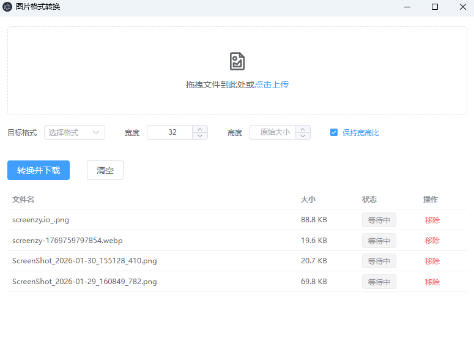
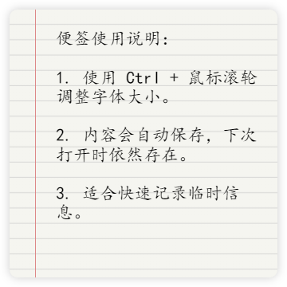

# Utility Widgets

A collection of useful widgets for [Widget.js](https://widgetjs.cn).
这是一个为 Widget.js 开发的实用小部件集合。

## Forex Rate Exchange (汇率换算)

这是一个简单的汇率显示组件。

- **支持**：实时显示多国货币汇率。
- **特性**：每分钟自动刷新数据。

**Quick summary (English):**
A simple widget to display foreign exchange rates.
- **Features**: Real-time display of multi-currency exchange rates.
- **Updates**: Refreshes data every minute.

---

## KeyStroke (按键显示)

这是一个按键可视化工具，可以在屏幕上显示你按下的每一个键。

- **支持**：实时显示键盘操作。
- **场景**：适合演示、直播或制作教程视频时展示快捷键。

**Quick summary (English):**
A keystroke visualization tool that displays every key you press on the screen.
- **Support**: Real-time display of keyboard operations.
- **Scenarios**: Ideal for showing shortcuts during presentations, live streaming, or tutorial videos.

---

## Water Reminder (喝水提醒)

一个帮助你养成健康习惯的喝水提醒工具。

- **支持**：定时提醒喝水。
- **特性**：记录每日饮水历史，帮助养成好习惯。

**Quick summary (English):**
A tool to help you build healthy habits by reminding you to drink water.
- **Support**: Scheduled reminders to drink water.
- **Features**: Tracks daily water intake history.

---

## Image Converter (图片格式转换)

一个强大的本地图片格式转换工具。

- **支持**：HEIC, JPG, PNG, WEBP, BMP, ICO 格式互转。
- **特性**：支持批量转换、自定义尺寸调整、保持长宽比。
- **场景**：设计师、开发者快速处理图片素材。

**Quick summary (English):**
A powerful local image format conversion tool.
- **Support**: Convert between HEIC, JPG, PNG, WEBP, BMP, and ICO formats.
- **Features**: Batch processing, custom resizing, aspect ratio preservation.
- **Scenarios**: Quick image processing for designers and developers.

---

## Quick Note (快速便签)

一个简单的桌面便签工具。

- **支持**：快速记录文字信息。
- **特性**：支持使用 `Ctrl + 滚轮` 快速调整字体大小。
- **场景**：临时记录待办事项、灵感或备忘录。

**Quick summary (English):**
A simple desktop note-taking tool.
- **Support**: Quickly record text information.
- **Features**: Adjust font size using `Ctrl + Mouse Wheel`.
- **Scenarios**: Temporary to-do lists, ideas, or memos.

---

## Usage (使用说明)

1. **Download**: Install **Widget Hub** from [https://widgetjs.cn](https://widgetjs.cn).
2. **Run**: Add the desired widget to your desktop.

## Links

⬇️ [All widgets](https://github.com/widget-js/widgets)
🔗 [Widget.js](https://widgetjs.cn)

